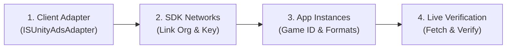

# Level Play Helper

[](https://unity.com)
[](https://docs.unity.com/en-us/grow/levelplay/)
[](package.json)
[](LICENSE)
[](#installation-unity-package-manager---git-url)

A drop-in, production-ready manager for **Unity LevelPlay (Ads Mediation)**. Add one component, fill in your keys, and get SDK initialization, GDPR/CCPA/COPPA consent, interstitial/rewarded/banner lifecycle with exponential-backoff retries, impression-level revenue events (ILRD), deep **Unity Ads & ironSource demand diagnostics**, an in-editor **LevelPlay Manager window** built with modern **UI Toolkit**, and a unified custom inspector — all without writing mediation boilerplate in your game code.

---

## Table of Contents

- [Why this package](#why-this-package)
- [Installation](#installation-unity-package-manager---git-url)
- [Quick Start](#quick-start)
- [LevelPlay Manager (UI Toolkit Editor Tool)](#levelplay-manager-ui-toolkit-editor-tool)
  - [Hub 1: Credentials & Formats](#hub-1-credentials--formats)
  - [Hub 2: Rules & Privacy](#hub-2-rules--privacy)
  - [Hub 3: Testing & Simulation](#hub-3-testing--simulation)
  - [Hub 4: Diagnostics & Cloud](#hub-4-diagnostics--cloud)
- [Unity Ads & LevelPlay Step-by-Step Integration Guide](#unity-ads--levelplay-step-by-step-integration-guide)
- [Custom Inspector](#custom-inspector)
- [Configuration Reference](#configuration-reference)
- [API Reference](#api-reference)
- [Events](#events)
- [Fallback Behavior (Rewarded Ads)](#fallback-behavior-rewarded-ads)
- [Privacy & Consent (GDPR / CCPA / COPPA)](#privacy--consent-gdpr--ccpa--coppa)
- [Impression-Level Revenue (ILRD) → Analytics](#impression-level-revenue-ilrd--analytics)
- [Extending: Game-Specific Subclass](#extending-game-specific-subclass)
- [Runtime Debug Overlay (F8)](#runtime-debug-overlay-f8)
- [Production Release Checklist](#production-release-checklist)
- [Architecture](#architecture)
- [Troubleshooting / FAQ](#troubleshooting--faq)
- [License](#license)

---

## Why this package

Integrating LevelPlay directly usually requires writing ~500 lines of lifecycle, error retry, threading, and consent plumbing into every project. Developers frequently encounter tricky edge cases:
- *What happens when a rewarded ad isn't ready when the player taps the button?*
- *Why is Unity Ads missing or failing to fill even though the adapter is installed?*
- *Did you turn off the Test Suite before shipping to Google Play or the App Store?*
- *Did you configure GDPR and CCPA before initializing the SDK?*

`LevelPlayHelper` centralizes all of this once, tested, and versioned — so your game only handles game-specific ad cadence and UI rewards.

---

## Installation (Unity Package Manager - Git URL)

1. Open **Window > Package Manager**
2. Click **+** > **Add package from git URL...**
3. Paste:

```
https://github.com/wagenheimer/UnityLevelPlayHelper.git
```

To pin a specific release:
```
https://github.com/wagenheimer/UnityLevelPlayHelper.git#v2.11.0
```

### Requirements

| Requirement | Version |
|---|---|
| Unity | 2022.3 LTS or newer (tested up to Unity 6) |
| Ads Mediation package (`com.unity.services.levelplay`) | 9.5.1 (stable UPM release) |
| Native dependency resolver | Mobile Dependency Resolver (MDR) or EDM4U |

---

## Quick Start

1. Add the `LevelPlayHelper` component to a persistent GameObject in your first scene (or use a prefab under `Resources`).
2. Open **Tools > Wagenheimer > Level Play Helper > LevelPlay Manager...** (or select the component Inspector).
3. Fill in your **App Key** and **Ad Unit IDs** for Android and/or iOS (or connect via the **Cloud API** tab to sync automatically).
4. Press Play — mock ads load automatically in the Unity Editor for instant testing!

```csharp
// 1. Show an interstitial ad
LevelPlayHelper.Instance.ShowInterstitial();

// 2. Show a rewarded ad (reward callback only fires when earned)
LevelPlayHelper.Instance.ShowRewardedAd(() =>
{
    player.AddCoins(50);
});

// 3. Show a banner ad
LevelPlayHelper.Instance.ShowBanner();
```

---

## LevelPlay Manager (UI Toolkit Editor Tool)

The package features a modern **UI Toolkit** dashboard (`LevelPlaySetupWindow`) shared with the component Inspector (`LevelPlayHelperEditor`). It organizes mediation management into **4 functional hubs**:

```
┌────────────────────────────────────────────────────────────────────────┐
│  LevelPlay Manager  [v2.11.0]     [Dashboard] [Ad Units] [Docs] [Sync] │
│  SDK: com.unity.services.levelplay (v9.5.1)                            │
├────────────────────────────────────────────────────────────────────────┤
│  [ Credentials & Formats ]  [ Rules & Privacy ]  [ Testing ]  [ Cloud ] │
└────────────────────────────────────────────────────────────────────────┘
```

### Hub 1: Credentials & Formats
- **Live Platform Switch**: Toggle between Android and iOS configurations.
- **Two-Way Data Binding**: Built on Unity's native `SerializedObject` system with full Undo/Redo (`Ctrl+Z`) support.
- **Real-Time Validation Badges**:
  - `OK` (Valid ID formatted correctly)
  - `WARN` (Empty format — automatically disabled)
  - `FAIL` (Placeholder detected or malformed character sequence)

### Hub 2: Rules & Privacy
- **Ad Pacing Rules (`AdsConfiguration`)**: Configures minimum intervals, initial interval pacing, and reduction rates.
- **Privacy & Consent Regulations (`ConsentConfiguration`)**:
  - **GDPR**: Configures user consent state before initialization.
  - **CCPA / CPRA**: User opt-out flags for data sales.
  - **COPPA**: Child-directed treatment flags for minors.

### Hub 3: Testing & Simulation
- **LevelPlay Test Suite**: Toggle and validate on-device test suite tools.
- **In-Game Debug Overlay**: Enable the runtime UI Toolkit overlay (`ADS DBG` / `F8`).
- **Editor Mock Test Mode**: Safe simulation of ad load and display callbacks in the Unity Editor without live SDK overhead.
- **Development Build**: Quick toggle for Unity development build flags.

### Hub 4: Diagnostics & Cloud
Hosts two powerful verification panels:
1. **Automated Setup Checklist**: 8 collapsible categories scanning packages, resolvers, permissions (`AD_ID`, `INTERNET`), manifests, and code usage.
2. **Cloud API & Demand Networks Hub**: Connects directly to the LevelPlay Management API to inspect applications, ad units, and demand network instances.

---

## Unity Ads & LevelPlay Step-by-Step Integration Guide

LevelPlay requires concurrent demand from both **ironSource** and **Unity Ads** to maximize auction competition and fill rates. 

Because Unity migrated to the new **Unity Cloud Dashboard**, follow these 4 steps in the **Cloud API** tab:



### Step 1: Install the Unity Ads Adapter (Client-Side)
- Open **Ads Mediation > Network Manager** in Unity.
- Verify `Unity Ads` adapter is installed (version `5.14.0+`).
- The helper will detect `ISUnityAdsAdapterDependencies.xml` automatically.

### Step 2: Link Unity Ads in the LevelPlay Dashboard (Account-Level)
1. In the helper, click **Open SDK Networks** (navigates to [`https://platform.ironsrc.com/partners/next/networks`](https://platform.ironsrc.com/partners/next/networks)).
2. Locate **Unity Ads** and enter:
   - **API Key**: Your Unity Ads API Key.
   - **Organization Core ID**: Your Unity Organization ID (e.g. `22730`).
3. ⚠️ **IMPORTANT**: Turn **OFF** the toggle for **Bidder auto-setup**. *(The new Unity Cloud dashboard uses manual instance mapping; keeping auto-setup on will produce an error).*
4. Click **Save**.

### Step 3: Configure App Instances & Placements (Per-App)
1. In the helper, click **Open Instances** (navigates to [`https://platform.ironsrc.com/partners/next/mediation/instances/`](https://platform.ironsrc.com/partners/next/mediation/instances/)).
2. Select your app (iOS or Android).
3. Enter your **Game ID** from the [Unity Cloud Dashboard](https://cloud.unity.com/) (**Monetization > Apps**).
4. Click **+ Add instance** for each ad format:
   - **Rewarded**: Name = `UnityAds_Rewarded` | Placement ID = `Rewarded_iOS` (or `Rewarded_Android`) | Status = **Active**.
   - **Interstitial**: Name = `UnityAds_Interstitial` | Placement ID = `Interstitial_iOS` (or `Interstitial_Android`) | Status = **Active**.
   - **Banner**: Name = `UnityAds_Banner` | Placement ID = `Banner_iOS` (or `Banner_Android`) | Status = **Active**.
5. Click **Save**.

### Step 4: Real-Time Live Verification
1. Return to the **Cloud API** tab in Unity.
2. Click **Fetch & Verify Setup**.
3. The real-time table will audit all instances:
   - `ironSource: LIVE`
   - `Unity Ads: LIVE (UnityAds_Rewarded)`
   - `[✓ Synced to Prefab]`

---

## Custom Inspector

Selecting any `LevelPlayHelper` (or your custom subclass) in the Unity hierarchy or project assets displays the full **UI Toolkit** editor:

- **Quick Header**: Displays current package version, SDK status, and direct buttons for Manager Window, Dashboard, and Documentation.
- **Embedded Tabs**: Switch between Credentials, Rules, Testing, and Diagnostics directly inside the Unity Inspector.
- **Inspector Mode Adaptations**: Clean layout designed specifically for standard Inspector widths with full data-binding support.

---

## Configuration Reference

| Field | Type | Default | Description |
|---|---|---|---|
| `androidAppKey` / `iosAppKey` | string | `""` | App Key from LevelPlay dashboard per platform. |
| `androidInterstitialAdUnitId` / `iosInterstitialAdUnitId` | string | `""` | Interstitial Ad Unit ID (empty = disabled). |
| `androidRewardedAdUnitId` / `iosRewardedAdUnitId` | string | `""` | Rewarded Ad Unit ID (empty = disabled). |
| `androidBannerAdUnitId` / `iosBannerAdUnitId` | string | `""` | Banner Ad Unit ID (empty = disabled). |
| `bannerPosition` | `BannerPositionPreset` | `BottomCenter` | One of 9 standard LevelPlay banner positions. |
| `adsConfig` | `AdsConfiguration` | — | Cadence intervals and reduction thresholds. |
| `consentConfig` | `ConsentConfiguration` | — | GDPR, CCPA/CPRA, and COPPA compliance flags. |
| `enableTestSuite` | bool | `false` | Launches on-device LevelPlay Test Suite after init. |
| `enableDebugOverlay` | bool | `true` | Enables the runtime `ADS DBG` / `F8` diagnostic overlay. |

---

## API Reference

### Lifecycle
- `LevelPlayHelper.Instance`: Static singleton access.
- `LevelPlayHelper.Instance.Initialize()`: Applies privacy settings and initializes the SDK.
- `LevelPlayHelper.Instance.IsSdkInitialized`: True once initialization finishes.
- `LevelPlayHelper.Instance.SetUserConsent(bool)`: Updates and persists GDPR consent in `PlayerPrefs`.

### Ad Display
- `ShowInterstitial()`: Displays interstitial ad if ready; initiates reload on failure.
- `IsInterstitialReady()`: Returns readiness state for interstitials.
- `ShowRewardedAd(Action onReward)`: Shows rewarded ad; invokes `onReward` callback only when earned.
- `IsRewardedAdReady()`: Returns readiness state for rewarded ads.
- `TryShowAd(Action onReward)`: Fallback method prioritizing rewarded ads over interstitials.
- `ShowBanner()` / `HideBanner()` / `DestroyBanner()`: Controls banner display and memory lifecycle.

---

## Events

All events are **static**, allowing subscription from any system without holding instance references:

```csharp
LevelPlayHelper.OnSdkInitialized      += config => { /* SDK ready */ };
LevelPlayHelper.OnInterstitialClosed  += () => { /* Resume gameplay */ };
LevelPlayHelper.OnRewardedAdGranted   += () => { /* Reward granted */ };
LevelPlayHelper.OnAdRevenuePaid       += (adUnitId, revenue) => { /* ILRD analytics */ };
LevelPlayHelper.OnImpressionDataReady += data => { /* Raw SDK payload (background thread) */ };
```

---

## Fallback Behavior (Rewarded Ads)

To protect user experience and retain players even during ad network outages, `ShowRewardedAd` executes a graceful fallback strategy:

1. **Rewarded ad is ready** → Displays ad and grants reward upon completion.
2. **Rewarded not ready, Interstitial is ready** → Shows interstitial and grants reward immediately.
3. **No ads available** → Grants reward directly without showing an ad.

In all cases, an ad reload is queued immediately with exponential backoff.

---

## Runtime Debug Overlay (F8)

In the Unity Editor and Development Builds, tap the **ADS DBG** button or press **F8** to open the runtime diagnostic HUD:

- **WHY NOT LOADING Banner**: Diagnoses the exact root cause of delivery failures (missing keys, consent not granted, paused units, mock state).
- **State Machine Inspection**: Real-time status (`Idle`, `Loading`, `Ready`, `Showing`, `Failed`).
- **Live Event Log**: Color-coded, thread-safe event log with instant **Copy Report** to clipboard.
- **Interactive Triggers**: Manually trigger ad loads, shows, banner toggles, and consent testing.

---

## Production Release Checklist

Before building for release:
- [ ] Open **LevelPlay Manager > Diagnostics** and ensure all automated checklist items pass.
- [ ] Verify both **ironSource** and **Unity Ads** are marked `LIVE` in the Cloud tab.
- [ ] Ensure **Enable Test Suite** is disabled.
- [ ] Confirm real App Keys and Ad Unit IDs are entered (no placeholders).
- [ ] Verify native dependencies resolved (`Assets > External Dependency Manager > Android/iOS Resolver`).
- [ ] On Android, verify `AD_ID` permission is declared for target API 33+.

---

## Architecture

```
Your Game Logic
  └── LevelPlayHelper (Singleton MonoBehaviour)
        ├── LevelPlayPrivacySettings (GDPR / CCPA / COPPA)
        ├── LevelPlayAdFormat (Rewarded / Interstitial / Banner)
        └── Unity.Services.LevelPlay (Ads Mediation SDK v9.5.1)
              ├── ironSource Network Demand
              └── Unity Ads Network Demand (Bidding & Waterfall)
```

---

## License

Distributed under the [MIT License](LICENSE).
